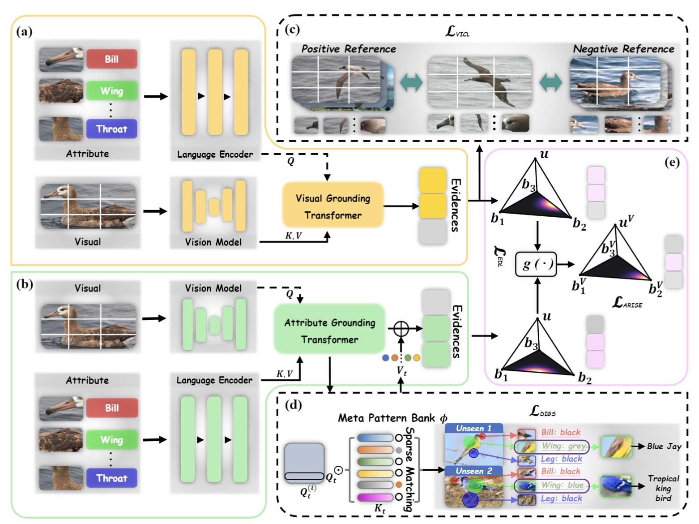

# CREST: Cross-modal Resonance through Evidential Deep Learning for Enhanced Zero-Shot Learning

## Overview



## 🔥 News

- `2024-04` Our paper is released on [arXiv](https://arxiv.org/abs/2404.09640).
- `2024-04` The code for pre-processing the data is available now! 

## Dependencies
```bash
$ pip install -r requirements.txt
```

#### Details
- Python==3.9.18
- numpy==1.26.1
- scikit_learn==1.2.2
- torch==2.0.1
- torchvision==0.15.2
- tqdm==4.65.0
- transformers==4.31.0

## Step 1: Data Preparation 🗂️

Before your model can start flexing its muscles, you need to gather the superhero team of datasets: CUB, SUN, and AWA2. Just like assembling a team of avengers, make sure you've got the right versions:

- [CUB](https://www.vision.caltech.edu/datasets/cub_200_2011/) - Caltech-UCSD Birds-200-2011
- [SUN](http://cs.brown.edu/~gmpatter/sunattributes.html) - SUN Attribute Database: Discovering, Annotating, and Recognizing Scene Attributes
- [AWA2](http://cvml.ist.ac.at/AwA2/) - *A* **free** *dataset for* *Animals Attribute Based Classification* *and* *Zero-Shot Learning*

Oh, and don't forget the rookie of the year, `xlsa17`. You'll find them hanging out [here](http://datasets.d2.mpi-inf.mpg.de/xian/xlsa17.zip).

Once you've got them all, decompress them in a folder that looks like this:

```
.
├── data
│   ├── CUB/CUB_200_2011/...
│   ├── SUN/images/...
│   ├── AWA2/Animals_with_Attributes2/...
│   └── xlsa17/data/...
└── ···
```

## Step 2: Cooking the Features 🎆

Now, let's turn the heat up and cook those raw features until they're golden! Open your terminal and let the magic begin:

```bash
$ python preprocessing.py --dataset CUB --compression --device cuda:0
$ python preprocessing.py --dataset SUN --compression --device cuda:0
$ python preprocessing.py --dataset AWA2 --compression --device cuda:0
```


## Train and Evaluation

TeleAI takes data confidentiality seriously. Our source and code are undergoing a thorough review process and will be shared with the community once approved. Your understanding is appreciated—stay tuned!


## 🤝 Citation

```bigquery
@misc{huang2024crest,
      title={CREST: Cross-modal Resonance through Evidential Deep Learning for Enhanced Zero-Shot Learning}, 
      author={Haojian Huang and Xiaozhen Qiao and Zhuo Chen and Haodong Chen and Bingyu Li and Zhe Sun and Mulin Chen and Xuelong Li},
      year={2024},
      eprint={2404.09640},
      archivePrefix={arXiv},
      primaryClass={cs.CV}
}
```